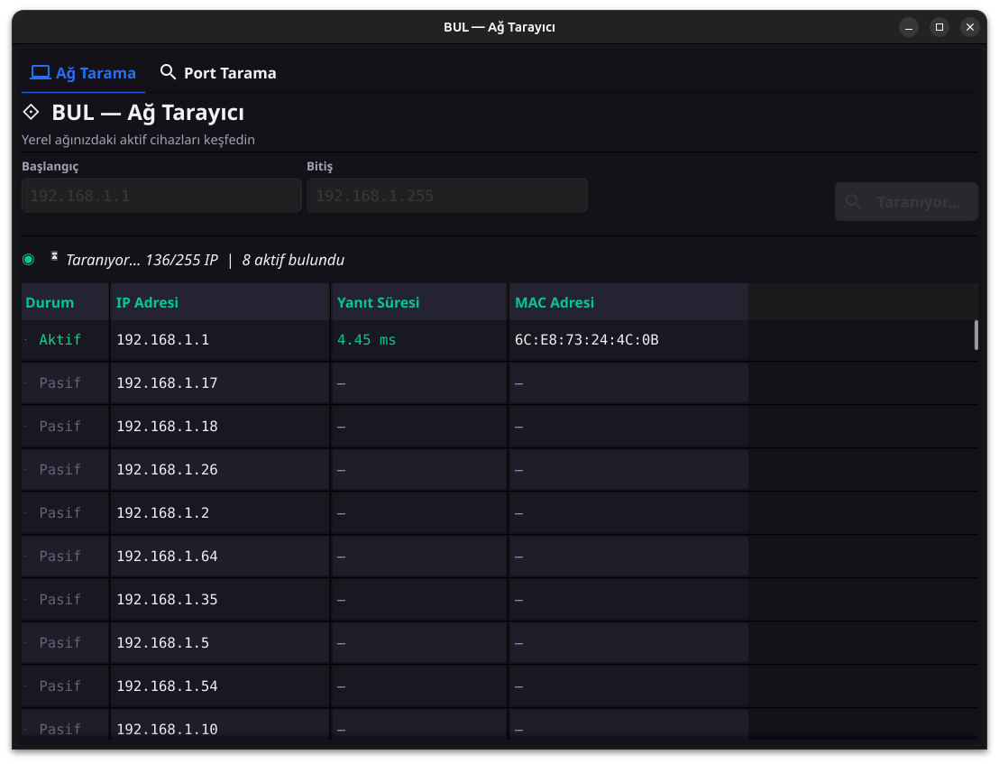
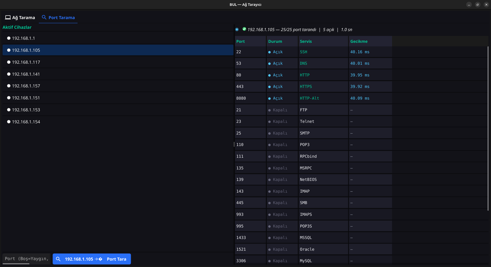

# BUL — Ağ ve Port Tarayıcı 🔍

**BUL**, Go dilinin gücünü (Goroutines ve Channel'lar) modern ve minimalist bir arayüzle (Fyne v2) birleştiren eşzamanlı (concurrent) bir yerel ağ ve port tarayıcısıdır. Kullanıcı dostu ve yüksek kontrastlı koyu (dark) temasıyla, ağınızdaki aktif cihazları saniyeler içinde keşfetmenizi ve analiz etmenizi sağlar.

## Ekran Görüntüleri

### Ağ Tarama (Cihaz Keşfi)

*IP aralığı belirleyerek ağdaki aktif cihazların durumlarını, yanıt sürelerini (ms) ve MAC adreslerini eşzamanlı olarak tespit eder.*

### Port Tarama (Servis Tespiti)

*Tespit edilen cihazların en yaygın 25 portunu, spesifik bir portunu (ör. 8080) veya belirli bir port aralığını (ör. 50-120) tarar ve açık portları en üstte vurgular.*

---

## Özellikler ✨

- **Hızlı Ağ Tarama:** Verilen IP aralığını (`192.168.1.1` - `255`) ICMP (Ping) kullanarak tarar ve cihazın ayakta (aktif/pasif) olup olmadığını raporlar.
- **Detaylı Bilgi:** Aktif cihazlar için yanıt süresi (RTT) ve MAC adresi (ARP tablosu üzerinden) çözümler.
- **Gelişmiş Port Tarama:** Ağda bulunan cihazları listeden seçip, tek tıkla port taraması yapabilirsiniz.
  - **Yaygın Portlar:** Boş bırakıldığında otomatik 25 kritik port (HTTP, HTTPS, SSH, FTP, MySQL vb.) taranır.
  - **Özel/Aralık Tarama:** `8080` (tek port) veya `50-120` (port aralığı) belirleyebilirsiniz.
  - **Akıllı Sıralama:** Tarama bittiğinde açık olan portlar otomatik olarak listenin en üstüne taşınır.
- **Eşzamanlılık & Performans:** Arka planda `Goroutine`'ler, `Channel`'lar ve Semaphore mimarisi kullanılarak arayüzü dondurmadan arka planda maksimum verimle çalışır. Fyne'ın Data Binding özelliği sayesinde sonuçlar canlı olarak ekrana yansır.
- **Çapraz Platform (Cross-Platform):** GitHub Actions otomasyonu ile Windows (.exe), Linux ve macOS (Apple Silicon & Intel) için derlenebilir ve tamamen yerel bir uygulama gibi çalışır.

## Kullanım 🚀

### Geliştirici Olarak Çalıştırmak
Sisteminizde [Go 1.22+](https://go.dev/) kurulu olduğundan emin olun.
```bash
# Bağımlılıkları indirin
go mod tidy

# Uygulamayı başlatın (Ping paketleri için sudo gerekebilir)
go run .
```

### Derlenmiş Sürümü İndirmek
Projenin GitHub **Releases** sekmesine giderek işletim sisteminize uygun çalıştırılabilir dosyayı indirebilir ve kurulum gerektirmeden direkt çalıştırabilirsiniz.

## Teknoloji Yığını 💻
- **Backend:** Go (Golang)
- **Concurrency:** Goroutines, Channels, sync.WaitGroup, sync.RWMutex
- **Arayüz (GUI):** [Fyne v2](https://fyne.io/)
- **Data Binding:** `fyne.io/fyne/v2/data/binding` 
- **Sistem İletişimi:** `os/exec` ile ARP okuması ve ICMP ping işlemi.

---
*Furkan Selek tarafından geliştirilmiştir.*
